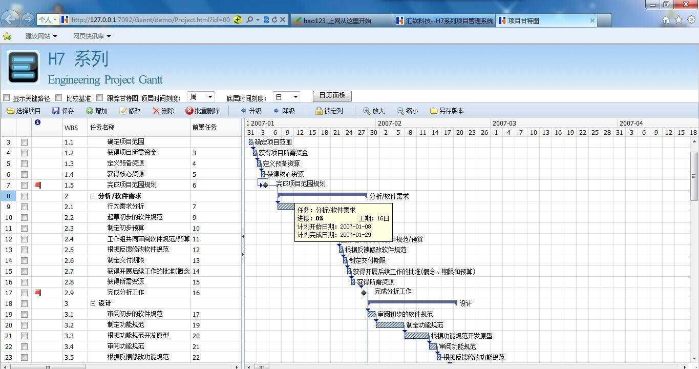
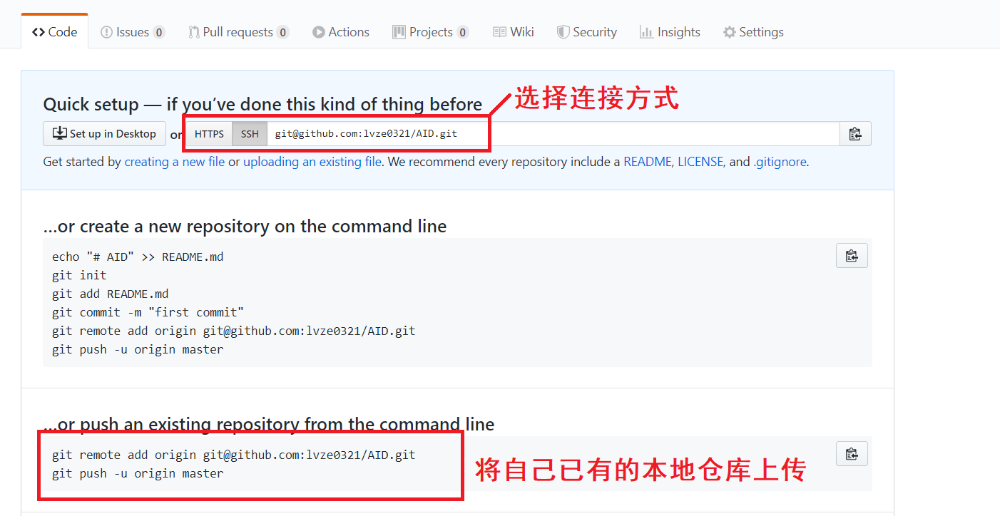

综合项目及工具
==========================

| Tedu Python 教学部 |
| --- |
| Author：吕泽|

-----------

[TOC]

## 1. 软件项目开发

### 1.1 软件项目开发流程

```
需求分析 ----> 概要设计  ---> 项目计划 ----> 详细设计---> 编码测试 -----> 项目测试 ----> 调试修改 ---> 项目发布----> 后期维护
```

* 需求分析 ： 确定用户的真实需求 

>  1. 确定用户的真实需求，项目的基本功能
>  2. 确定项目的整体难度和可行性分析
>  3. 需求分析文档，用户确认

* 概要设计：对项目进行初步分析和整体设计

> 1. 确定整体架构
> 2. 进行技术可行性分析
> 3. 确定技术整体思路和使用框架模型
> 4. 形成概要文档指导开发流程


* 项目计划 ： 确定项目开发的时间轴和流程

> 1. 确定开发工作的先后顺序
> 2. 确定时间轴  ，事件里程碑
> 3. 人员分工 
> 4. 形成甘特图和思维导图等辅助内容



* 详细设计 ： 项目的具体实现

> 1.形成详细设计文档 ： 思路，逻辑流程，功能说明，技术点说明，数据结构说明，代码说明

* 编码测试 ： 按照预定计划实现代码编写，并且做基本检测

> 1. 代码编写
> 2. 写测试程序
> 3. 技术攻关

* 项目测试 ： 对项目按照功能进行测试

> 1. 跨平台测试 ，使用测试
> 2. 根据测试报告进行代码修改
> 3. 完成测试报告

* 项目发布

> 1.项目交付用户进行发布
>
> 2.编写项目说明文档

* 后期维护

> 1.维护项目正常运转
>
> 2.进行项目的迭代升级

### 1.2  开发注意事项

* 按时完成项目工作和项目时间不足之间的冲突
* 项目实施人员之间的冲突

### 1.3 项目管理工具

* 编写文档： word  ppt  excel  markdown   LaTex
* 项目流程图 ： Mindmanager  visio
* 项目管理 ： project
* 代码管理 ： svn   git


## 2. GIT和GitHub

### 2.1 GIT概述

* 什么是GIT

  GIT是一个开源的分布式版本控制系统，用于高效的管理各种大小项目和文件。

* 代码管理工具的用途
  * 防止代码丢失，做备份
  * 项目的版本管理和控制，可以通过设置节点进行跳转
  * 建立各自的开发环境分支，互不影响，方便合并
  * 在多终端开发时，方便代码的相互传输

* GIT的特点

  * git是开源的，多在*nix下使用，可以管理各种文件

  * git是分布式的项目管理工具(SVN是集中式的)

  * git数据管理更多样化，分享速度快，数据安全

  * git 拥有更好的分支支持，方便多人协调

    

* Linux下GIT安装

> sudo apt  install  git


### 2.2 GIT使用


* 基本概念
  * 工作区：项目所在操作目录，实际操作项目的区域
  * 暂存区: 用于记录工作区的工作（修改）内容
  * 仓库区: 用于备份工作区的内容
  * 远程仓库: 远程主机上的GIT仓库

> 注意： 在本地仓库中，git总是希望工作区的内容与仓库区保持一致，而且只有仓库区的内容才能和其他远程仓库交互。


#### 2.2.1 初始配置

* 配置命令： git config --global [选项]
* 配置文件位置:  ~/.gitconfig

1. 配置用户名

```
e.g. 将用户名设置为Tedu
sudo git config --global user.name Tedu
```

2. 配置用户邮箱

```
e.g. 将邮箱设置为lvze@tedu.cn
git config --global user.email lvze@tedu.cn
```

3. 查看配置信息

```
git config --list
```

> 注意： 该命令需要在某个git仓库下执行


#### 2.2.2 基本命令

* 初始化仓库

  ```
  git  init 
  意义：将某个项目目录变为git操作目录，生成git本地仓库。即该项目目录可以使用git管理
  ```

  

* 查看本地仓库状态

  ```git
  git  status
  说明: 初始化仓库后默认工作在master分支，当工作区与仓库区不一致时会有提示。
  ```

  

* 将工作内容记录到暂存区

  ```
  git add [files..]
  
  e.g. 将文件 a ，b 记录到暂存区
  git add  a b
  
  e.g. 将所有文件（不包含隐藏文件）记录到暂存区
  git add  *
  ```


* 取消文件暂存记录

  ```
  git rm --cached [file] 
  ```

* 设置忽略文件

  在GIT项目中可以在项目根目录添加**.gitignore**文件的方式，规定相应的忽略规则，用来管理当前项目中的文件的忽略行为。.gitignore 文件是可以提交到公有仓库中，这就为该项目下的所有开发者都共享一套定义好的忽略规则。在.gitignore 文件中，遵循相应的语法，在每一行指定一个忽略规则。

	```
	.gitignore忽略规则简单说明
	
	file            表示忽略file文件
	*.a             表示忽略所有 .a 结尾的文件
	!lib.a          表示lib.a除外
	build/          表示忽略 build/目录下的所有文件，过滤整个build文件夹；
	```

  

* 将文件同步到本地仓库

```
git commit [file] -m [message]
说明: -m表示添加一些同步信息，表达同步内容,不加file表示同步所有暂存记录的文件

e.g.  将暂存区所有记录同步到仓库区
git commit  -m 'add files'
```


* 查看commit 日志记录

  ```
  git log
  git log --pretty=oneline
  ```

  

* 将暂存区或者某个commit点文件恢复到工作区

  ```
  git checkout [commit] -- [file]
  
  e.g. 将a.jpg文件恢复,不写commit表示恢复最新保存的文件内容
  git checkout  --  a.jpg
  ```

  

* 移动或者删除文件

  ```
  git  mv  [file] [path]
  git  rm  [files]
  注意: 这两个操作会修改工作区内容，同时将操作记录提交到暂存区。
  ```

  

### 2.3 版本控制

* 退回到上一个commit节点

  ```
  git reset --hard HEAD^
  说明： 一个^表示回退1个版本，依次类推。当版本回退之后工作区会自动和当前commit版本保持一致
  ```

  

* 退回到指定的commit_id节点

  ```
  git reset --hard [commit_id]
  ```

  

* 查看所有操作记录

  ```
  git reflog
  注意:最上面的为最新记录，可以利用commit_id去往任何操作位置
  ```

  

* 创建标签

  * 标签: 在项目的重要commit位置添加快照，保存当时的工作状态，一般用于版本的迭代。

    ```
    git  tag  [tag_name] [commit_id] -m  [message]
    说明: commit_id可以不写则默认标签表示最新的commit_id位置，message也可以不写，但是最好添加。
    
    e.g. 在最新的commit处添加标签v1.0
    git tag v1.0 -m '版本1'
    ```

    

* 查看标签

```
 git tag  查看标签列表
 git show [tag_name]  查看标签详细信息
```

* 去往某个标签节点
```
git reset --hard [tag]
```

* 删除标签
```
git tag -d  [tag]
```


###  2.4 保存工作区

* 保存工作区内容

  ```
  git stash save [message]
  说明: 将工作区未提交的修改封存，让工作区回到修改前的状态
  ```

* 查看工作区列表

  ```
  git stash  list
  说明:最新保存的工作区在最上面
  ```

* 应用某个工作区

  ```
  git stash  apply  [stash@{n}]
  ```

* 删除工作区

  ```
  git stash drop [stash@{n}]  删除某一个工作区
  git stash clear  删除所有保存的工作区
  ```


### 2.5 分支管理

#### 2.5.1 基本概念

* 定义: 分支即每个人在原有代码（分支）的基础上建立自己的工作环境，完成单独开发，之后再向主分支统一合并工作内容。

* 好处

  * 各自开发互不干扰

  * 防止误操作对其他开发者的影响

    

#### 2.5.2 基本操作

* 查看现有分支

  ```
  git branch
  说明: 前面带 * 的分支表示当前工作分支
  ```

  

* 创建分支

  ```
  git branch [branch_name]
  说明: 基于a分支创建b分支，此时b分支会拥有a分支全部内容。在创建b分支时最好保持a分支"干净"状态。
  ```

* 切换工作分支

  ```
  git checkout [branch]
  说明: 2,3可以同时操作，即创建并切换分支
  ```

  >  注意： git checkout -b [branch_name]  可以同时完成创建分支和切换分支的工作

* 合并分支

  ```
  git merge [branch]
  ```

  > 注意：分支的合并一般都是子分支向父分支中合并

* 删除分支

  ```
   git branch -d [branch]  删除分支
   git branch -D [branch]  删除没有被合并的分支
  ```

  

#### 2.5.3 分支冲突问题

* 定义： 当分支合并时，原来的父分支发生了变化，在合并过程中就会产生冲突问题，这是合并分支过程中最为棘手的问题。

* 冲突情形1—— 原来的分支增加了新文件或者原有文件发生了变化

  此时合并可能会出现:

  

  此时只要先摁 **ctrl-o** 写入，然后回车，再摁**ctrl-x** 离开就可以了。

  也可能出现提示让直行commit合并，那么此时只需要直行commit操作就可以了。这种冲突比较好解决。

  

* 冲突情形2—— 子分支和父分支修改了相同的文件

  此时会出现：

  

  这种冲突不太好解决需要自己进入文件进行修改后，再直行add ，commit操作提交

* 总结

  * 尽量在项目中降低耦合度，不同的分支只编写自己的模块。
  * 如果必须修改原来父级分支的文件内容，那么做好分工，不要让多个分支都修改同一个文件。

### 2.6 GitHub使用

* 远程仓库

  远程主机上的GIT仓库。实际上git是分布式结构，每台主机的git仓库结构类似，只是把别人主机上的git仓库称为远程仓库。GitHub可以帮助我们建立一个远程仓库。

* GitHub介绍

  GitHub是一个开源的项目社区网站，拥有全球最多的开源项目。开发者通过可以注册网站账户，在GitHub建立自己的项目仓库（我们可以视作一个远程仓库）,GitHub规定GIT为它的唯一代码管理工具。

  GitHub网址：[github.com](https://github.com/)


#### 2.6.1 获取项目

- 在左上角搜索栏搜索想要的获取的项目


- 选择项目后复制项目git地址


- 在本地使用git clone方法即可获取

```
git clone https://github.com/xxxxxxxxx
```

> 注意:
>
> 1. 获取到本地的项目会自动和GitHub远程仓库建立连接。且获取的项目本身也是个git项目。
> 2. GitHub提供两种地址链接方式，http方式和SSH方式。通常访问自己的项目可以使用SSH方式，clone别人的项目使用http方式。  


#### 2.6.2 创建自己的项目仓库

- 点击右上角加号下拉菜单，选择新的仓库


- 填写相应的项目信息即可

  

- github仓库相对本地主机就是一个远程仓库通过remote连接

  

  - 使用https链接

  	```
    # 后续操作每次上传内容都需要输入密码，比较麻烦，一般用于临时计算机的连接使用
    git remote  add origin https://github.com/xxxxxxxxx
    ```

  - 使用SSH连接

    ```
    # 先建立秘钥信任
    1. 将自己要连接github的计算机的ssh公钥内容复制
    2. github上选择头像下拉菜单，settings-》SSH and GPG keys-》new SSH key
    ```
  3. 将公钥内容添加进去，并且起一个标题名字，点击添加
  
    
  
    
  
    ```
   #后续无需输入密码，一般用于自己信任的计算机
    git remote add origin git@github.com:lvze0321/AID.git 
    ```

- 查看连接的远程仓库名称

  ```
  git remote -v
  ```

  

- 断开远程仓库连接

  ```
  git remote rm [origin]
  ```

  

- 如果是自己的仓库需要删除，则选择自己的仓库选择settings，在最后可以选择删除仓库。


#### 2.6.3 远程仓库操作命令

* 将本地分支推送给远程仓库

	```
	# 将master分支推送给origin主机远程仓库，第一次推送分支使用-u表示与远程对应分支	建立自动关联
	git push -u origin  master

	git push origin  [:branch]  # 删除向远程仓库推送的分支
	```

* 推送代码到远程仓库

	```
	# 如果本地的代码有修改项推送给远程仓库
	git push
	```

* 推送标签

   ```
   git push origin [tag]  推送一个本地标签到远程
    
   git push origin --tags  推送所有本地所有标签到远程
   
   git push origin --delete tag  [tagname]  删除向远程仓库推送的标签
   ```

  

* 推送旧的版本

  ```
  # 用于本地版本比远程版本旧时强行推送本地版本
  git push --force origin  
  ```


* 从远程获取代码

	```
	git pull
	```


## 3. 综合项目案例


### 3.1 在线词典

* 功能说明

>用户可以登录和注册

```
* 登录凭借用户名和密码登录
* 注册要求用户必须填写用户名，密码，其他内容自定
* 用户名要求不能重复
* 要求用户信息能够长期保存
```


>可以通过基本的图形界面print以提示客户端输入。

```
* 程序分为服务端和客户端两部分
* 客户端通过print打印简单界面输入命令发起请求
* 服务端主要负责逻辑数据处理
* 启动服务端后应该能满足多个客户端同时操作
```


>客户端启动后即进入一级界面，包含如下功能：登录    注册    退出

	* 退出后即退出该软件
	* 登录成功即进入二级界面，失败回到一级界面
	* 注册成功可以回到一级界面继续登录，也可以直接用注册用户进入二级界面


>用户登录后进入二级界面，功能如下：查单词    历史记录    注销

	* 选择注销则回到一级界面
	* 查单词：循环输入单词，得到单词解释，输入特殊符号退出单词查询状态
	* 历史记录：查询当前用户的查词记录，要求记录包含name   word   time。前10条均可。

```
"""
v 客户端，发送请求，接收结果展示
"""

from socket import *
import sys

ADDR = ("127.0.0.1",8889)

def do_register(sockfd):
    """
    处理注册请求函数
    """
    while True:
        name = input("User:")
        passwd = input("Password:")

        if " " in name or " " in passwd:
            print("用户名密码不能包含空格")
            continue

        msg = "R %s %s"%(name,passwd)
        sockfd.send(msg.encode())

        result = sockfd.recv(128).decode()
        if result == 'OK':
            print("注册成功")
        else:
            print("注册失败")
        return

def do_login(sockfd):
    """
    处理登录请求函数
    """
    name = input("User:")
    passwd = input("Password:")

    msg = "L %s %s"%(name,passwd)
    sockfd.send(msg.encode())

    result = sockfd.recv(128).decode()
    if result == 'OK':
        print("登录成功")
        login(sockfd,name)
    else:
        print("登录失败")
    return

def do_query(sockfd,name):
    """
    处理查询单词请求函数
    """
    while True:
        word = input("单词('##'返回):")
        if word == '##':
            break
        msg = "Q %s %s"%(name,word)
        sockfd.send(msg.encode())
        data = sockfd.recv(2048)
        print(data.decode())

def do_history(sockfd,name):
    """
    处理历史记录请求函数
    """
    msg = "H " + name
    sockfd.send(msg.encode())
    while True:
        data = sockfd.recv(1024).decode()
        if data == '##':
            break
        print(data)

def login(sockfd,name):
    """
    二级显示界面函数
    """
    while True:
        print("""
        ===============Query===============
         1.查单词     2.历史记录     3.注销
        ===================================
        """)
        cmd = input("请输入选项:")
        if cmd == '1':
            do_query(sockfd,name)
        elif cmd == "2":
            do_history(sockfd,name)
        elif cmd == "3":
            return
        else:
            print("请输入正确命令。")

def main():
    """
    主函数
    """
    try:
        sockfd = socket()
        sockfd.connect(ADDR)
    except:
        print("请检查你的网络后重试！")
        return

    while True:
        print("""
        ===========Welcome===========
         1.注册     2.登录     3.退出
        =============================
        """)
        cmd = input("请输入选项:")
        if cmd == '1':
            do_register(sockfd)
        elif cmd == "2":
            do_login(sockfd)
        elif cmd == "3":
            sockfd.send(b"E")
            sys.exit("谢谢使用")
        else:
            print("请输入正确命令。")

if __name__ == '__main__':
    main()
```

```
"""
c 逻辑控制， 基础结构搭建，接收请求，调用数据,数据整合提供给客户端
"""

from socket import *
from multiprocessing import Process
import signal,sys,time
from db import *

HOST = "0.0.0.0"
PORT = 8889
ADDR = (HOST,PORT)

db = Database()

def do_register(connfd,name,passwd):
    """
    注册函数
    """
    if db.register(name,passwd):
        connfd.send(b"OK")
    else:
        connfd.send(b"Fail")

def do_login(connfd,name,passwd):
    """
    处理登录函数
    """
    if db.login(name,passwd):
        connfd.send(b"OK")
    else:
        connfd.send(b"Fail")

def do_query(connfd,name,word):
    """
    查单词函数
    """
    db.insert_history(name,word)
    mean = db.query(word)
    if mean:
        data = "%s : %s"%(word,mean)
    else:
        data = "%s : Not Found"%word
    connfd.send(data.encode())

def do_history(connfd,name):
    """
    历史记录函数
    """
    data = db.history(name)
    for i in data:
        msg = "%-10s   %-10s   %-s"%i
        connfd.send(msg.encode())
        time.sleep(0.1)
    connfd.send(b'##')

def handle(connfd):
    """
    接收请求函数
    """
    db.cursor()
    while True:
        data = connfd.recv(1024).decode()
        tmp = data.split(' ')
        if not data or data == "E":
            break
        elif tmp[0] == 'R':
            do_register(connfd,tmp[1],tmp[2])
        elif tmp[0] == 'L':
            do_login(connfd,tmp[1],tmp[2])
        elif tmp[0] == 'Q':
            do_query(connfd,tmp[1],tmp[2])
        elif tmp[0] == 'H':
            do_history(connfd,tmp[1])
    connfd.close()
    db.cur.close()

def main():
    """
    主函数
    """
    sockfd = socket()
    sockfd.bind(ADDR)

    sockfd.listen(5)
    print("Listen the port %d"%PORT)

    signal.signal(signal.SIGCHLD,signal.SIG_IGN)

    while True:
        try:
            connfd,addr = sockfd.accept()
            print("Connect from",addr)
        except KeyboardInterrupt:
            db.close()
            sockfd.close()
            sys.exit("服务端退出")

        p = Process(target=handle,args=(connfd,))
        p.daemon = True
        p.start()

if __name__ == '__main__':
    main()
```

```
"""
M 负责数据库处理
"""

import pymysql

class Database:
    def __init__(self):
        """
        构造函数
        """
        self.db = pymysql.connect(host="localhost",
                             port=3306,
                             user="root",
                             password="123456",
                             database="dict",
                             charset="utf8")

    def cursor(self):
        """
        创建游标
        """
        self.cur = self.db.cursor()

    def close(self):
        """
        关闭
        """
        self.db.close()

    def register(self,name,passwd):
        """
        处理注册函数
        """
        sql = "select name from user where name=%s;"
        self.cur.execute(sql,[name])
        r = self.cur.fetchone() 
        if r:
            return False

        sql = "insert into user (name,passwd) values (%s,%s);"
        try:
            self.cur.execute(sql,[name,passwd])
            self.db.commit()
            return True
        except Exception as e:
            print(e)
            self.db.rollback()
            return False

    def login(self,name,passwd):
        """
        处理登录函数
        """
        sql = "select name from user \
              where binary name=%s and  binary passwd=%s;"
        self.cur.execute(sql,[name,passwd])
        r = self.cur.fetchone() 
        if r:
            return True
        else:
            return False

    def insert_history(self,name,word):
        """
        插入历史记录函数
        """
        sql = "select u_id from user where name=%s;"
        self.cur.execute(sql,[name])
        u_id = self.cur.fetchone()[0]

        sql = "insert into hist (word,u_id) values (%s,%s);"
        try:
            self.cur.execute(sql,[word,u_id])
            self.db.commit()
        except Exception as e:
            print(e)
            self.db.rollback()

    def query(self,word):
        """
        处理查单词函数
        """
        sql = "select mean from words where word=%s;"
        self.cur.execute(sql,[word])
        r = self.cur.fetchone() 
        if r:
            return r[0]

    def history(self,name):
        """
        查询历史记录函数
        """
        sql = "select name,word,time from \
              user join hist on user.u_id=hist.u_id \
              where name=%s order by time desc limit 10;"
        self.cur.execute(sql,[name])
        return self.cur.fetchall() 
```

